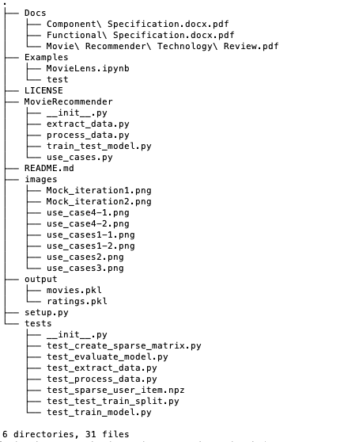
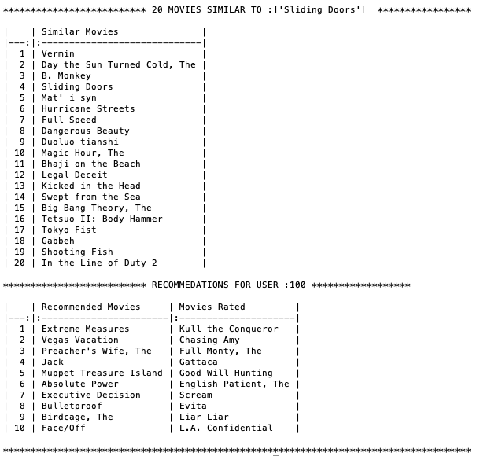
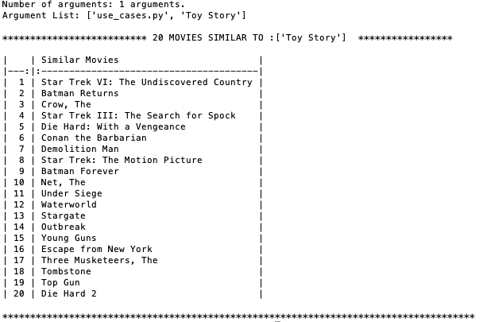
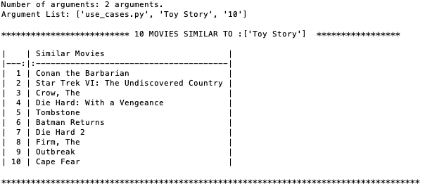
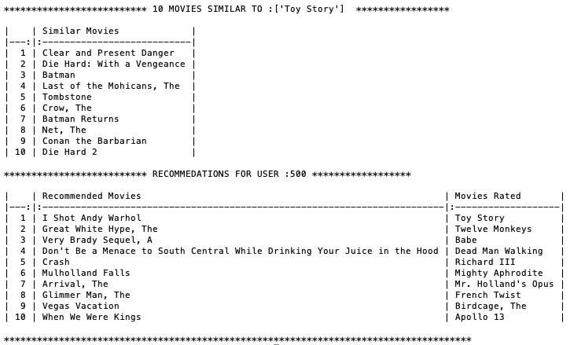

[](https://coveralls.io/github/sharmeelee/MovieRecommender?branch=main)

# IMDB Movie Recommender System
Authors: Priyanka Bijlani, Sharmeelee Bijlani, Laura Thriftwood, Lakshmi Venkatasubramanian
## Introduction
When considering which movie to watch, users have access to an overwhelming number of options. Users want custom recommendations to ensure optimal use of their time watching content. Business models benefit from strong recommender systems by increasing user engagement and addiction to streaming platforms. 
With this project, we can create our own movie recommendation system that takes user input of one movie and utilizes a rich dataset of movie titles, ratings and user information to output a recommended movie. 
### Data
Streaming Data - [MovieLens | GroupLens ](https://grouplens.org/datasets/movielens/100k/)
- Over 100k ratings
- 1700+ movie titles
- 1000+ users
### Directory Structure

### Program Functionality
1. User will get a movie recommendation from the system based on their movie watch and rating history.
  - Training input: users, movies, ratings
  - User input: user name/id
  - Outputs: movie(s)
  - ML algorithm: Collaborative filtering (analyzes historical data)

2. User will be able to provide a movie name and get similar movies.
  - Training input: users, movies, ratings
  - User input: movie
  - Outputs: movie(s)
  - ML algorithm: Collaborative filtering 

3. User will be able to predict the rating of a given movie based on their rating history.
  - Training input: users, movies, ratings
  - User input: User, movie
  - Outputs: rating
  - ML algorithm: Collaborative filtering 
## Running the Program
### Installation Instructions
Run the following commands in a linux terminal. 
Note: Python 3.8 required
```
git clone https://github.com/sharmeelee/MovieRecommender.git
```
```
cd MovieRecommender
```
```
python3 setup.py install
```
### Running the Use Cases
To run the program, you need to navigate within the directory to the MovieRecommender sub-folder where the use_cases.py file lives.
```
cd MovieRecommender
```
#### Use Case #1: No inputs
Running the use_cases.py file without any arguments is an example usage of the full functionality of the program. It outputs movie rating for the default user (user 100) along with 20 similar movie titles to the default movie (Sliding Doors) and top 10 movie recommendations for the default user. 
```
python3 use_cases.py
```
Expected Output:



#### Use Case #2: Input Movie Name
Running the use_cases.py file with one argument of a movie name returns movie ratings for the default user, 20 similar titles to the given movie name, and top 10 movie recommendataions for the default user. 
```
python3 use_cases.py "Toy Story"
```
Expected Output: 


#### Use Case #3: Input Movie Name and Number of Similar Items
Running the use_cases.py file with two arguments outputs predicted movie ratings by the default user, a number (set by user input) of similar movie titles to the given movie name, and top 10 movie recommendations for the default user. 
```
python3 use_cases.py "Toy Story" 10
```
Expected Output:


#### Use Case #4: Input Movie Name, UserID, and Number of Similar Items
Running the use_cases.py file with all three arguments outputs predicted movie ratings for the given user, a number (set by user input) of similar movie titles to the given movie name, and top 10 movie recommendataion for the given user ID.
```
python3 use_cases.py "Toy Story" 500 10
```
Expected Output:



